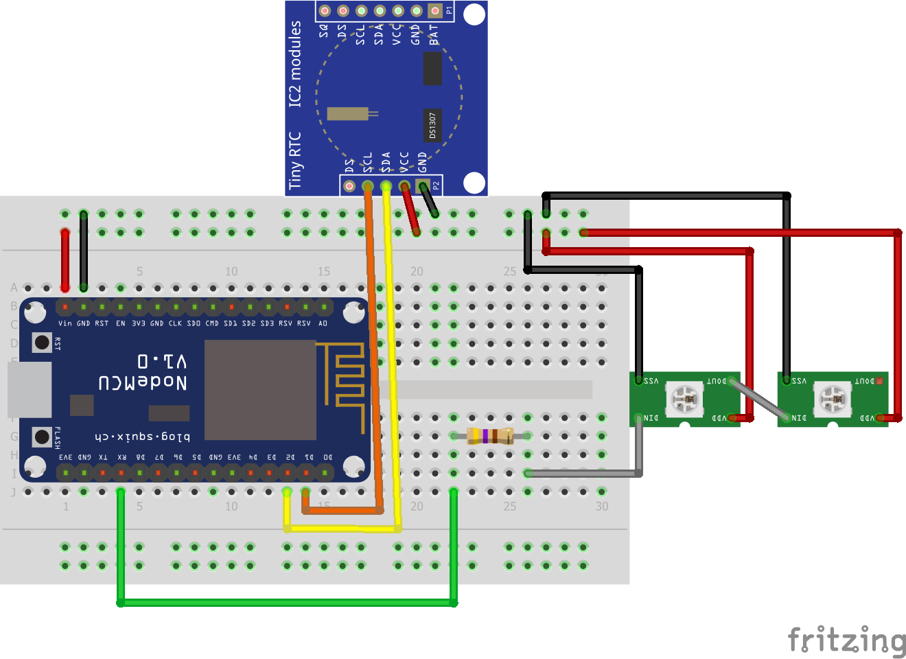

# Wordclock
This repo contains the code for my personal Arduino Wordclock build with some wood, an ESP8266 and plenty of WS2811 addressable lights.

Building a wordclock can also be done by multiplexing, but with the cheap addressable leds you can drive your wordclock and use it as a 11x10 led matrix with multiple colors.

# Hardware

- 1 ESP8266 I've used the NodeMCU. (€8)
- 1 DS1307, RTC module with backup battery (€3)
- 114 WS2811 addressable LEDS, with solderable circuitboard. (€20 for 100) [Image](ws2811-with-circuit.jpg)
- a lot of wire.
- 1 resistor 470Ω (best practice according to Adafruit)

# Circuit

I've only put 2 WS2812 leds in the picture, but you'll get point they are chain able!

# Code

The code is heavily inspired by [Javelin Word Clock](https://github.com/nitrohawk/Javelin-Word-Clock) and some sample libraries. I've tried to put in as much comments as possible.

## WIP
This is a work in progress and not done (by far). Please hold on.
